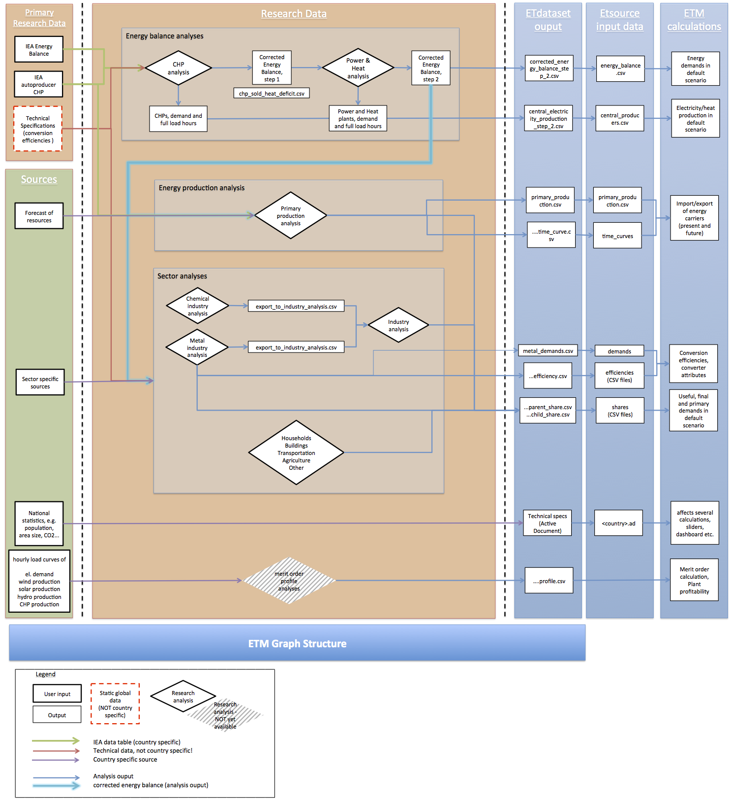

# ETDataset

This repository is dedicated to creating country-specific datasets for the Energy Transition Model. [ETModel](https://github.com/quintel/etmodel) requires 'Input Data' (a country-specific dataset) that is processed and displayed in the front-end ([et-model.com](http://et-model.com/)). ETDataset is the place where these datasets are created. 

It is for logging all issues and discussions encountered in the process of creating and maintaining Input Data. It involves the uniform Research Data itself, the Research Data Analyses used to process it into Input Data for the ETM, the use of country specific sources and other things. 

ETDataset contains all Research Analyses, they are stored in the 'analyses' folder. 
- to use these analyses (i.e. generate Input Data), please open them via the 'analysis_manager' or macros will not work
- to change an analysis itself, open the Excel file directly. *Note, that the analysis itself cannot store any data*. Read this entire 'README' to learn how we treat Excel file updates. 
- before the ETM can use the Input Data produced from research analyses, it needs to be copied to the [corresponding folders on the ETSource repository](https://github.com/quintel/etsource/tree/master/datasets), before it is used. Only do this via a pull request (see below)!

## Content
- analyses: This folder contains research analyses. These Excel files are 'tools' that are used to process Research Data. They do not contain any data themselves. 
- data: Contains country-specific data that is called, manipulated and outputted by the research analyses
- analysis_manager: Excel workbook that is the 'control room' for generating Input Data. The workbook stores macros that facilitate the generation process of Input Data. 

## Dataflow

This image outlines the dataflow that we use to generate Input Data from Research Data and assumptions based on Source Analyses. Note how the dataset generation process involves 10 consecutive steps and is largely based on a country's IEA energy balance. 


## Terminology 

If you are new to the project, please carefully read our introduction to [nomenclature](https://github.com/quintel/etdataset/blob/master/nomenclature.md). Make sure you are familiar with the terms *assumption, Input Data, Research Analysis, Research Data, Source Analysis* before you read on. These terms are used with a specific intended meaning. 

# Using this repository to generate a dataset for the ETM

Before getting started, you need to 

1. gain access to the [quintel/etdataset](https://github.com/quintel/etdataset), [quintel/etsource](https://github.com/quintel/etsource) and [quintel/atlas](https://github.com/quintel/atlas) repositories  
2. get up to speed with using git on your local computer. Clone the ETDataset, ETSsource and Atlas repositories into a common project folder on your computer. 
 - Please make sure that you have your `.gitconfig` set to always rebase (if someone else pushed their changes before you, this will lead to a merge conflict):
````
    [branch]
        autosetuprebase = always
````
3. make sure everything is up do take with `git up` on all repositories and a `bundle install` on *atlas* and *etsource*. 
4. have Microsoft Excel installed on your computer. You will have to allow  VBA scripts (macros) in order to work with these Excel files. These read input data and write output data. All our macros are stored in the Excel workbook analysis_manager.xlsm. These macros are safe and currently only work on Mac/Apple computers. 

In this section, we will first outline how you can generate input data with the Excel files (Research Analyses). Secondly, we will give a brief introduction on how you can upload (push) your work to this repository. 
Please also be aware of our glossary of [Git commands](https://github.com/quintel/etdataset/blob/master/Git_commands.md) and this [simple introduction to Git](http://try.github.io/levels/1/challenges/1), which may be helpful if you are new to working with the Git version control system. 

## Generating output files using the Excel analyses

To keep things as simple as possible, we describe the process from two perspectives: You might want to work on an existing dataset or you might want to create a new dataset (Input Data for a new country or a different year for a country that already has a dataset). We highly recommend that you first get acquainted with manipulating a dataset that already exists. Once you understand how everything works, you can create your own Input Dataset and start using the ETM to model a new country. 

### Manipulate Input Data of an existing dataset

1. first, make sure you have your local machine up to date (`git up` in the etsource and etdataset repositories).
2. next, make sure to [create a new branch](https://github.com/quintel/etdataset/blob/master/Git_commands.md#how-to-commit-and-push-changes-from-your-machine-to-github) in the ETDataset repository so you can easily discard results that are not to your liking.  
* open the 'analysis_manager' and enable the macros (a warning appears upon opening the analysis_manager). 
* in the dashboard of the 'analysis_manager' you can choose a country and year. All analyses will be opened with regard to the country and year you specified in the analysis manager. Choosing "nl" and "2011" will open our current Dutch dataset. 
* open the first analysis (1_CHP) by clicking the associated `open` button
* have a look around the analysis. You will notice that many checks fail (marked red). This is because the analysis still lacks inputs. 
* Go back to the finder, to the directory `~/etdataset/data/nl/2011/1_chp/input`. It contains the IEA energy balance and IEA autoproducer table for NL/2011. You will notice that next to the input folder, there is also an output folder. Here, all outputs of the NL 2011 CHP analysis will be written. 
* Go back to the Excel CHP analysis and hit the `import data` button on the top right of the 'Dasbhoard' sheet. This will import the IEA energy balance, IEA autoproducer table and previous dashboard values from the input folder. Furthermore, the technical specifications are loaded from etsource. (Note, that the 'import' buttons perform different actions in different analyses)
* since you have loaded an existing country and year, all checks on the dashboard are probably green now. You can look around and make changes to the inputs on the Dashboard sheet. 
* when you are done, you can choose between the following two options: 
 - *save your work*: Hit the 'export data' button on the analysis Dashboard. All relevant data will be written to CSV files in the respective output folder. Your Dashboard inputs will also be saved (input cells only). Existing files are overwritten. After the export is complete, the analysis will close automatically. 
 * *discard your work*: You may decide to close the analysis without hitting the 'export' button. Simply close the analysis, but DO NOT SAVE IT. You must never save data (dashboard inputs, energy balance etc.) in the analysis itself (see below). 

Now, you have gone through one cycle of opening an analysis for a certain country and year, importing and manipulating country specific information and exporting CSV files. If you made changes in the Dashboard of the CHP analysis and exported new CSV files, you may want to push these changes to a repository on Github. You might want to skip the following paragraph on 'creating an entirely new dataset' and continue with [Next steps](https://github.com/quintel/etdataset#next-steps).  

### Create new data for a new country or year

1. First, make sure you have your local machine up to date (`git up` in the etsource and etdataset repositories).
2. Next, make sure to [create a new branch](https://github.com/quintel/etdataset/blob/master/Git%20commands.md#1-create-a-new-branch-in-your-local-repository-and-make-sure-you-are-on-that-branch) so you can easily discard results that are not to your liking.  
* Open the 'analysis_manager' and enable the macros (a warning appears upon opening the analysis_manager). 
* In the analysis manager, fill in a new country and year. 
* Open the `1_CHP analysis` with the `open` button
* Since the analysis for that specific country and year has not been performed yet, the analysis manager will raise a warning if you really want to create that country or year. If you hit `yes`, the analysis manager will create a new folder in `~/etdataset/data/(country)/(year)/1_chp/input/`
* You need to obtain the IEA energy balance and IEA autoproducer table for your country and year. This data can be bought on http://data.iea.org/ieastore/default.asp. You will need to purchase an 'Extended energy balance' and a 'Net electricity and heat production by autoprocuder' table. Make sure you download an EXCEL file from the IEA website, it turns out that the CSV file reports fewer significant digits! After downloading these files, you need to save them as CSV files, in a *very specific format*. Look at the NL data as a role model. Both data tables need to have the exact same headers in the exact same position. If you align cells differently, your data will be pasted into a wrong position, which the Excel analyses cannot deal with. Make sure that your data tables do not contain more/less headers than our NL example. Copy the CSV files into the `~/etdataset/data/(country)/(year)/1_chp/input/` folder, use default file names (see NL data folder). Furthermore, you should be aware of the fact that IEA tables may contain confidential cells. Non-numerical cells in unexpected locations may cause problems in the Excel calculations. 
* Upon clicking the 'import data' button in the CHP analysis, you will notice that some of the imports failed. 
 * The import of the IEA energy balance and autoproducer table may fail. Make sure you created those CSV files with the correct file name, in the right location. 
  * The import of 'dashboard values' will fail, because there is no dashboard.csv file in the `~/etdataset/data/(country)/(year)/(analysis)/input` folder yet. You can import dashboard settings from a different analysis (there is a button for that purpose), or simply fill the Dashboard manually. 
* Now, adjust your inputs to the Dashboard until all critical checks pass. If you want to create high quality Input Data, you will need to create a 'Source Analysis' that justifies you inputs. You may want to ask yourself questions like: How much conventional capacity is installed? How many full load hours are realistic? Filling in the CHP analysis tends to be a bit like solving a puzzle, so do not expect a perfect result. 
* If you want to save your work, you need to hit the 'export' button. Do not save your work in the Excel workbook. You can open the analysis again later, and load the settings you exported. 
* Once you are done with the CHP_analysis, you can move on to the power and heat plant analysis (PP_HP) and so forth...


### Next Steps
A few final remarks about the research analyses that might help you with generating a meaningful dataset: It is important that you work on the analyses in the given order. The inputs to later analyses often depend on outputs of previous analyses. It is possible to jump ahead and have a look at other analyses. But in the end you will have to export CSV files from all analyses in the given order. Especially changes in the CHP analysis may have a great impact on the PP_HP analysis: you might have to correct your PP_HP dashboard inputs again after changes in the CHP analysis. Creating a complete input dataset is an iterative process!

Once you have finished your work with the analysis_manager, you may want test the impact of your changes on ETModel (on your local machine) and eventually 'push' your changes back to the ETDataset repository. 

You may want to get to know some [Git commands](https://github.com/quintel/etdataset/blob/master/Git_commands.md). You will need these to make sure your changes are stored in a meaningful way. 

#### Testing a country on your local machine

1. move all relevant files in the "data/country/year/output" folders to etdataset. This can be done by running `rake import`, or `rake import DATSET=nl` in ETSource. 
* test if all converter demands can be calculated: Go to the "atlas" repository, and run `rake debug DATASET=nl` (you may want to add `FAST=true` to that command line, to skip the generation of graphs). (advanced users: alternatively, you can also run `bundle exec rspec` on ETSource, which also tests whether all calculations succeed.)  
* run etengine and etmodel locally and compare with the beta or production servers of the ETM. 

If you added an entirely new country to ETSource, you should read this [documentation on adding a new area to the ETM](https://github.com/quintel/documentation/blob/master/developer/Add_a_Region.mdown) (advanced users). 

When you are satisfied with your dataset you may want to push your work to the remote Github repositories. 

#### Push your changes to Github (share your work)
After you have tested your changes on your local machine (at least make sure that atlas/refinery does not complain), you may want to push your changes to Github. Please continue reading, we will outline the necessary steps below. 

## Rules (Code of Conduct) 
There are a couple of rules that you need to follow when collaborating with other people via Git. There also some extra rules that apply to working on this repository: 

1. First and most importantly, YOU MAY NEVER SAVE COUNTRY SPECIFIC DATA WITHIN AN EXCEL ANALYSIS. The excel analyses are just tools to calculate output from certain inputs. The Excel files are never used to store data. You will not be allowed to upload Excel files to GitHub that contain country specific information. More specifically, Excel files may NOT contain: Energy balances, autoproducer tables, technical specifications, dashboard inputs. 
Excel analysis files are only saved after a *functional* update. All necessary files (both outputs generated and inputs used to do so) will be saved and written to the right directory using VBA code (a 'macro'). The reason you should not save the Excel is that this will prompt Git to notice the file changed, prompting you to commit and push the changes. Since these changes will not be accepted (you have to use a pull request), you will have to discard them anyway. For more information refer to [Using Git on Binary files](https://github.com/quintel/etdataset/blob/master/Technical_readme.md#using-git-on-both-binary-and-data-files) 
* Under certain conditions it may be legitimate to make changes to the calculations, text or formatting of an analysis. These changes have to be committed on their own branch, committing only one change at a time. 

This calls for a 'code of conduct' or workflow for handling changes to the Excel. How do we resolve a merge conflict? How do we choose which Excel analysis file we want to keep and which we want to discard? Observing a couple of simple rules will makes this quite easy.

**Rule 1: two people should NEVER work on the same Excel analysis file simultaneously** 

**Rule 2: ALWAYS commit changes to Excel files SEPARATELY from data changes, so you can revert to older datasets without having to revert to older Excel versions** 

**Rule 3: always use pull requests instead of just pushing your changes** 

**Rule 4: every commit has to be well documented**


## Commits
Please refer to our [walk-through](https://github.com/quintel/etdataset/blob/master/Git_commands.md#how-to-commit-and-push-changes-from-your-machine-to-github) if you are not familiar with working with Git. 

Typically there are two kinds of commits: 1. commits of changes to an Excel analysis and 2. commits of new sets of input and output files. The latter are generated for each analysis step that is completed and involve only text. They are easily dealt with by Git. The former involve binary files, which are less straightforward when using Git. For this reason it makes sense to put them into two separate repositories. Note that you may have accidentally saved the Excel file, when all you wanted to do was generate a set of input and outputs. Git will interpret this as a file change. You need to checkout (discard) such changed Excel files, since they will not be accepted anyway, before staging and committing the changed input and output files  

### Committing input and output files
The best thing to do is to commit the inputs and outputs for each analysis step. That way if something goes wrong it is easy to roll back step by step. When committing inputs and outputs, at least state the following in the commit message:

- which Excel analysis step it involves
- the reason for creating new input and output files
- what kind of changes you made to the data 

### Committing changes to Excel analysis files

When changing Excel analysis files, make sure to document the changes to the Excel both in the Excel file itself (on the changelog sheet) and in the commit message. 
Commit one changed Excel file at a time. If you do not properly document your commit, your pull request will not be considered. 

Consider the fall-out of your changes. Will more or fewer csv-files be exported to etsource? Do we need to add/delete new/superfluous files somewhere else? 

State the following in the commit message:

- which Excel file you created or changed
- what worksheets you made changes on 

## Pull requests
After you made changes on your local machine, you push your 'new_branch' to GitHub as described in the  [walk-through](https://github.com/quintel/etdataset/blob/master/Git_commands.md#how-to-commit-and-push-changes-from-your-machine-to-github). You then end up with a pull request that you assign to a Quintel team member. 
Should you run into a merge conflict, please refer to the 'Merge conflicts and troubleshooting' of the [Git_commands.md](https://github.com/quintel/etdataset/blob/master/Git_commands.md#merge-conflicts-and-troubleshooting).

