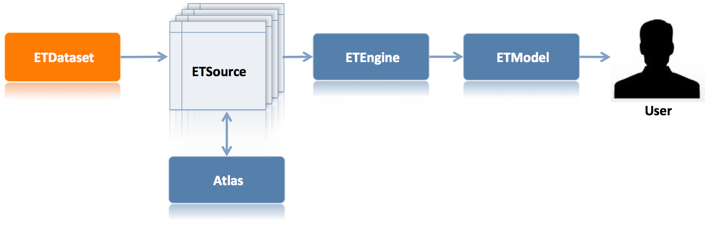
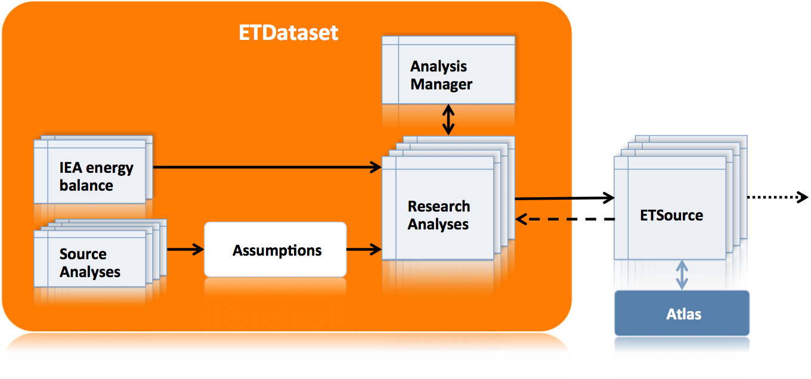

# ETDataset - Start here

## Country datasets
Each country shown in the [Energy Transition Model (ETM)](http://www.et-model.com) requires a *country-specific dataset* (**Input Data**) to correctly model the energy system of that country. The ETDataset repository is dedicated to creating these *country-specific datasets*. Once a complete dataset has been created it needs to be exported to [ETSource](https://github.com/quintel/etsource) from where the Input Data will be used in calculations by [ETEngine](https://github.com/quintel/etengine). The user can interact with the model through the front-end of the [ETM](http://www.et-model.com) that is maintained in the [ETModel](https://github.com/quintel/etmodel) repository. The Input Data is created by various **Research Analyses**. In addition to creating datasets, the ETDataset repository is used for logging all issues and discussions encountered in the process of creating and maintaining Input Data.

One of the key ingredients in the creation of a dataset is the IEA energy balance. Since these energy balances are proprietary, they cannot be published in a public repository. Therefore, we created two versions of the ETDataset repository:

1. [**ETDataset**](https://github.com/quintel/etdataset) is a **private** repository that is used by Quintel to generate the Input Data for all countries shown in the ETM. This repository is private, because it contains the IEA energy balances.
- [**ETdataset-public**](https://github.com/quintel/etdataset-public) is a **public** copy of the [ETDataset](https://github.com/quintel/etdataset) repository, but without the proprietary energy balances. This repository is available for informative purposes. The repository also contains the entire dataset (including a fictional energy balance) for the country *example* that can be used to review the dataset generation process. Running the dataset generation process for a real country requires the purchase of the IEA energy balance for that country.

More information on the generation of Input Data for a countr and a more in-depth explanation of the relation between ETDataset and ETDataset-public can be found [here](/documentation/generate_output_files.md). If you want to make changes to the model or if you would like to add a new country, have a look at [this page](/documentation/generate_output_files.md). Contact [Quintel](http://quintel.com/contact) if you desire more information.

## Global dataset
ETDataset's second function is to share the research on all technologies and carriers used by the Energy Transition Model. As explained in the [Documentation repository](https://github.com/quintel/documentation#the-energy-calculation), the ETM can be represented as a network of connected energy conversion technologies. The properties of these technologies are called **attributes** and the converters themselves are called **nodes**. These node attributes and the research on which they are based have been documented here.

Since these attributes are the same in all countries, we call this the '**Global dataset**'.

## Content

The ETDataset repository contains the following folders and files:

- The [**Analysis Manager**](analysis_manager.xlsm) is an Excel workbook that serves as the *control room* for generating Input Data. The Analysis Manager contains macros that facilitate the generation process of Input Data.
- The [**Analyses**](/analyses) folder contains the **Research Analyses**, Excel files that are *tools* used to process Research Data. They do **not** contain any data themselves. The various analyses can be opened via the [Analysis Manager](analysis_manager.xlsm). See [Dataflow](#dataflow) for an explanation.
- The [**Data**](/data) folder contains country-specific data that are imported, manipulated and exported by the Research Analyses.
- The [**Nodes Source Analyses**](/nodes_source_analyses) folder contains the analyses for each node. IF you want to know what publications and attributes we used for all the technologies, this is where you need to be. 
- The [**Source Analyses**](/source_analyses) folder contains analyses for the assumptions used in the various Research Analyses. Whereas the [Analyses](/analyses) folder contains analyses for the *uniform data* sources, i.e. sources of data that are formatted in the same way for all countries, like Energy Balances for example, the [Source Analyses](/source_analyses) directory contains the *non-uniform data* and manipulation of such data. For example, data on how many diesel and gasoline carsare found in a country.
- The [**Documentation**](/documentation) folder contains additional and more detailed information for this repository.

##  Dataflow

This image outlines the dataflow that we use to generate country specific Input Data from Research Data (the IEA energy balance) and assumptions based on Source Analyses. The generation of Input Data occurs in various Research Analyses. Descriptions of the various Research Analysis and a detailed visualization of the dataflow can be found [here](analyses/README.md).

## Terminology

If you are new to the project, please carefully read our introduction to the [nomenclature](documentation/nomenclature.md). Make sure you are familiar with the terms **Input Data**, **Research Analysis**, **Research Data**, **assumption**, **Node Source Analysis** and **Source Analysis** before you read on. These terms are used with a specific intended meaning.

# Generate a country dataset for the ETM

The main purpose of this repository is to create country-specific datasets that serve as input for the ETM. In this section we will outline the **Input Data** generation process using the **Analysis Manager** and **Research Analyses**.

To keep things as simple as possible, we describe the process from two perspectives. First, you might want to investigate how Input Data is generated and perform minor adjustments to the dataset. Second, you might want to create a new dataset (i.e. Input Data for a new country or a different year for a country that already has a dataset). We highly recommend that you first get acquainted with manipulating a dataset that already exists. Once you understand how everything works, you can create your own dataset and start using the ETM to model a new country.

The process of generating **Input Data** is divided into three steps:

1. [**Generating output files**](#1-generating-output-files)
2. [**Testing the dataset**](#2-testing-the-dataset)
3. [**Sharing your work**](#3-sharing-your-work)

## 1. Generating output files

The process of generating Input Data is covered by a range of Research Analyses, stored in the [Analyses](/analyses) folder. The [Analysis Manager](analysis_manager.xlsm) serves as control room for managing the process. It it important that you work on the analyses in the given order to end up with a meaningful dataset. Often input to later analyses depends on the output of previous analyses. Nevertheless, creating a complete dataset is an iterative process and you might want to jump back or ahead to have a look at other analyses. However, in the end you have to make sure you export the Input Data files from all analyses in the given order.

- [**Before getting started**](documentation/generate_output_files.md#before-getting-started) describes the prerequisites for starting with the dataset generation process.
- [**A. Investigate the Input Data generation process**](documentation/generate_output_files.md#a-investigate-the-input-data-generation-process) is a walk-through to get familiar with the Analysis Manager and the analyses.
- [**B. Manipulate Input Data of an existing dataset**](documentation/generate_output_files.md#b-manipulate-input-data-of-an-existing-dataset) is a walk-through describing the steps required to make minor changes to an existing dataset.
- [**C. Create Input Data for a new country or year**](documentation/generate_output_files.md#c-create-input-data-for-a-new-country-or-year) is a walk-through for generating a whole new dataset for a new country or a new starting year.

Once you have finished your dataset, you may want to test the impact of your changes on the ETM (on your own computer) and eventually share your changes with others.

## 2. Testing the dataset

Testing your dataset for the ETM involves two steps:

1. You should test if [Atlas](https://github.com/quintel/atlas) perform its calculations with your dataset. [Atlas](https://github.com/quintel/atlas) is dedicated to inializing the [graph structure](https://github.com/quintel/documentation#the-energy-calculation) and energy flows for the ETM.
- You should investigate the impact of your changes on the ETM results by running [ETEngine](https://github.com/quintel/etengine) and [ETModel](https://github.com/quintel/etmodel) on your local machine.

See the [Testing locally](documentation/testing_locally.md) documentation for a detailed instruction. When you are satisfied with your dataset, you can start sharing your work.

## 3. Sharing your work

The tools and data of ETDataset are available in this **GitHub** repository. **Git** is a version control tool that enables easy collaboration within projects. You can obtain all files, make changes, upload those changes and request for review and merge into the *master* project. A short introduction to GitHub can be found [here](http://guides.github.com/overviews/desktop/#intro).

Sharing your work involves the following steps:

1. [**Creating a new branch**](documentation/working_with_git.md#1-create-a-new-branch-in-your-local-repository-and-make-sure-you-are-on-that-branch)
- [**Commit your changes**](documentation/working_with_git.md#2-make-your-changes-to-files-excel-files-or-csv-inputoutput-files)
- [**Push commits to remote repository**](documentation/working_with_git.md#3-push-your-changes-to-remote-repository-note-how-you-have-to-explicitly-name-a-remote-branch-to-push-to)
- [**Create a pull request**](documentation/working_with_git.md#4-go-to-github-and-create-a-pull-request-for-you-new-branch)

Furthermore, the [Understanding the GitHub Workflow](http://guides.github.com/overviews/flow/) page gives a 5-minute introduction to these steps. Do you want an introduction to Git in an interactive way, please try the [15-minute course](http://try.github.io/levels/1/challenges/1).

### Commits

Typically there are two kinds of commits: [commits of new sets of input and output files](#committing-input-and-output-files) and [commits of changes to an Excel analysis](#committing-changes-to-excel-analysis-files). The first are generated for each analysis step that is completed and involve only text files. They are easily dealt with by Git. The latter involve [binary files](http://en.wikipedia.org/wiki/Binary_file), which are less straightforward when using Git.
Changes to input and output files and changes to Excel files should be committed in different commits. When you accidentally saved the Excel file during the dataset generation process, you should checkout (i.e. discard) the changed Excel file (see [Commit your changes](documentation/working_with_git.md#2-make-your-changes-to-files-excel-files-or-csv-inputoutput-files).

#### Committing input and output files

The best thing to do is to commit the inputs and outputs for each analysis step. That way if something goes wrong it is easy to roll back step by step. When committing inputs and outputs, at least state the following in the commit message:

- Which Excel analysis step it involves.
- The reason for creating new input and output files.
- What kind of changes you made to the data.

#### Committing changes to Excel analysis files

When changing Excel analysis files, make sure to document the changes to the Excel both in the Excel file itself (on the *Changelog* sheet) and in the commit message.
Commit one changed Excel file at a time. If you do not properly document your commit, your pull request will not be considered.

Consider the fall-out of your changes. Will more or fewer csv-files be exported to etsource? Do we need to add or delete new or superfluous files somewhere else?

State the following in the commit message:

- Which Excel file you created or changed.
- What worksheets you made changes on.
- What kind of changes you made to the analysis.

### Pull requests

After you **commit** changes on your local machine, you **push** your `new_branch` to GitHub as described in the [walk-through](documentation/working_with_git.md#how-to-commit-and-push-changes-from-your-machine-to-github). Your changes are then online and visible for other, but not yet **merged**. By following the walk-through you will end up with a **pull request** that you assign to a Quintel team member.

### Rules (Code of Conduct)

There are a couple of rules that you need to follow when collaborating with other people via Git. There also some extra rules that apply to working on this repository:

1. **Every commit has to be well documented.**
- **Always use pull requests instead of just pushing your changes.**
- **Country-specific data is NEVER stored within an Excel analysis.** More specifically, Excel files may not contain energy balances, autoproducer tables, technical specifications and dashboard inputs.
- **Commit data changes seperately from changes to Excel files.** Only under certain conditions it may be legitimate to make changes to the calculations, text or formatting of an analysis.

