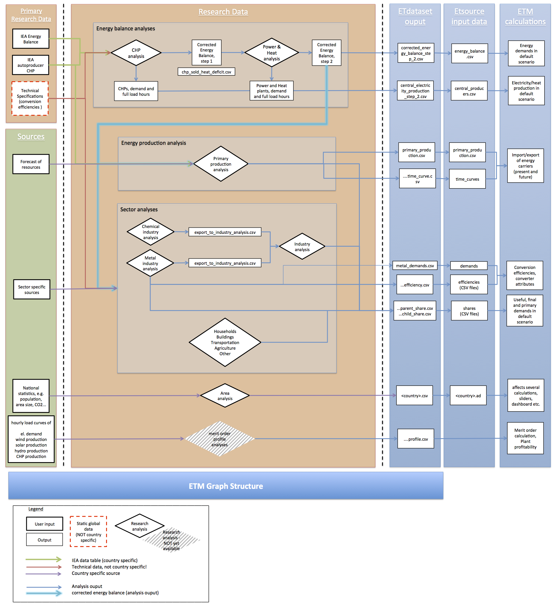

# Research analyses

The ETM requires **energy data** and **technical data** to work. The technical data comprises the structure of the [graph](https://github.com/quintel/documentation#the-energy-calculation) and the specifications of converters, including efficiencies and costs. The energy data makes the ETM country specific and defines the energy that 'flows through the graph'. Where the technical data is specified in the [ETSource](https://github.com/quintel/etsource) repository, the energy data is generated using **Research Analyses** (also know as **Analyses**) in the [ETDataset](https://github.com/quintel/etdataset). The set of energy data supplied by this repository is called **Input Data**.

The [Analysis Manager](../analysis_manager.xlsx) is the starting point for generating Input Data. It serves as control room for opening and running the Analyses. In the Analyses the following data is imported or need to be provided:

### Energy balance

Each of the Analyses requires an **energy balance**, which is either the *original Eurostat energy balance* (in the CHP analysis) or a *corrected energy balance* (in all following analyses). The energy balance is imported using the `import` button on the **Dashboard** sheet of the Analyes.
The energy balance provides the elementary energy data for a given country. Since the energy balance does not provide enough detail for the ETM, additional assumptions are required for generating more detailed energy figures.
For example, the energy balance only provides information on *final demand* of energy carriers, e.g. the total electricity consumption in households. However, this electricity consumption can be used for various applications, such as space heating (using heat pumps), cooking (using an electric stoves) and lighting. Because these applications are specified in the ETM, additional assumptions about the energy consumption by these applications are required.

### Assumptions

The **Assumptions** required to analyse, interpretet and manipulate the energy data need to be provided on the **Dashboard** sheet of the Analyses. The Assumptions themself can be generated using [Source Analyses](../source_analyses). There are various checks available on the Dashboard to given an indication of the validity of your assumptions.

### Information from other analyses

Analyses can also require data from other analyses. For example, the Power and heat plant analyses requires a *corrected energy balance* from the CHP analysis and the Industry analysis requires data tables from the Metal industry analysis and the Chemical industry analysis.

See [below](#detailed-below) for a more detailed figure of the dataflow.

## Energy production analyses

Currently, the Research Analyses flow consist of twelve consecutive analyes. The first three analyses are destignated for the analyses of heat and electricity production in CHPs, power and heat plants; and for the definition of the primary production of energy carriers. Both the central production (e.g. power plants) and the decentral production (e.g. PV in households) of electricity is covered in the first analyses.

### 1. CHP analysis

The CHP analysis is the first step in the Input Data generation process. The goal of the CHP analysis is to determine the input and output of the various sector-specific CHPs in the ETM. However, this cannot be obtained directly from the energy balance, because:

1. Not all fuel input and heat output of CHPs are reported by the IEA. The unsold heat production (heat that is used by the owner of CHP) is not reported; the fuel required to produce that heat is reported as final consumption.
2. The fuel input for CHPs is not specified for the different sectors.

Main goal of the CHP analyses is therefore to provide a **corrected energy balance** and a list of electricity producers. Please refer to the [CHP analysis](1_chp_analysis.xlsx) for more documentation.

<!-- Additional documentation is available for internal use on `~/Dropbox/Quintel/Projects/Restructure Research Dataset/Etdataset/Research Analyses/analyses/1_chp/Documentation/20130917 Documentation CHP analysis.docx`. -->

### 2. Power and heat plant analysis

The Power and heat plant analysis proceeds with the **corrected energy balance** from the CHP analysis. Main goal is to determine the input and output of the power and heat plants in the ETM. These figures are based on the energy balance (the total amount of an energy carrier that is used for power or heat production) and assumptions about the technologies that are used (the share of the energy carrier that is used in a specific power or heat plant).

The Power and heat plant analysis provides among other a further corrected energy balance and an appended list of electricity producers. Please refer to the [Power and heat plant analysis](2_power_and_heat_plant.xlsx) for more documentation.

<!-- Additional documentation is available for internal use on `~/Dropbox/Quintel/Projects/Restructure Research Dataset/Etdataset/Research Analyses/analyses/2_power_and_heat_plant/Documentation/20130830 Documentation Power and heat plant analysis.docx`. -->

### 3. Primary production analysis

The Primary production analysis is used to define the primary production of energy carriers, partly based on the energy balance and partly based on assumption (including values for the base year or timecurves). Please refer to the [Primary production analysis](3_primary_production_analysis.xlsx) for more documentation.

## Sector analyses

Largest part of the analyses are used to provide Input Data for a specified economic sector, e.g. industry, residences and transport. These sectors are also distinguished in the front-end of the ETM. These sectors are partly specified in the energy balance (*final demand*), but not in the level of detail as they are in the ETM (*useful demand*). The final demand in the sector should therefore be further divided into various applications in the sector. This division is exported as *shares*, i.e. the percentage of the final demand that is used for a certain application. For example, in the Transport analysis need to be specified what amount of gasoline is used in cars and what amount is used in trucks. This is needed because the energy balance only provides information on the total gasoline use for road transport.

### 4a. Metal industry analysis

In the Metal industry analysis, the energy consumption of the steel producing, aluminium producing and other metals producing technologies are calculated based on the physical production of steel and aluminium, the shares of technologies and the metal industry-specific data on the energy balance. The energy consumption of the Metal industry is also exported to the Industry analysis. Please refer to the [Metal industry analysis](4a_metal_industry_analysis.xlsx) for more documentation.

### 4b. Chemical industry analysis

In the Chemical industry, the energy consumption is calculated based on the chemical industry-specific data on the energy balance. The energy consumption of the Chemical industry is also exported to the Industry analysis. Please refer to the [Chemical industry analysis](4b_chemical_industry_analysis.xlsx) for more documentation.

### 5. Industry analysis

The Industry analysis collects the energy consumption data of the Metal industry and the Chemical industry and calculates the energy consumption in the remaining industrial sectors based in the industry-specific data on the energy balance. Please refer to the [Industry analysis](5_industry_analysis.xlsx) for more documentation.

### 6. Residences analysis

The Residences analysis is used to distribute the final demand that is reported on the energy balance over various applications, e.g. space heating, hot water, space cooling, lighting, cooking and appliances. Furthermore, assumptions are required concerning old and new houses and insulation values. Please refer to the [Residences analysis](6_residences_analysis.xlsx) for more documentation.

### 7. Services analysis

Similar to the Residences analysis, the Services analysis is used to distribute the final demand that is reported on the energy balance over various applications, including space heating, space cooling and lighting. Please refer to the [Services analysis](7_services_analysis.xlsx) for more documentation.

### 8. Transport analysis

The transport sector is divided into domestic aviation, road, rail, etc. on the energy balance. However, both cars and trucks are included in road transport. The Transport analysis is among other used to determine the fuel use in cars and trucks. Please refer to the [Transport analysis](8_transport_analysis.xlsx) for more documentation.

### 9. Agriculture analysis

The Agriculture analysis fulfills similar purpose as the analyses described above. Please refer to the [Agriculture analysis](9_agriculture_analysis.xlsx) for more documentation.

### 10. Other analysis

The Other analysis covers the energy consumption that is not included in the analyses described above. Please refer to the [Other analysis](10_other_analysis.xlsx) for more documentation.

## Miscellaneous

### 11. Area analysis

The Area analysis is used to collect a range of country specific parameters that are required to make the ETM work. These parameters include:

- Which modules and features need to be enabled in the ETM.
- Country specific figures, e.g. for the area of the areable land, the lenght of the coast line and the number of inhabitants; furthermore, amongst others, parameters need to be defined with respect to buildings and CO2 emissions.

Please refer to the [Area analysis](11_area_analysis.xlsx) for more documentation.

## Detailed dataflow

The figure below describes the dataflow from primary research data and sources to the calculations in ETEngine.

1. Primary Research Data and Sources
2. Research Analyses
3. ETDataset output data
4. ETSource input data
5. ETM calculations (ETEngine)

