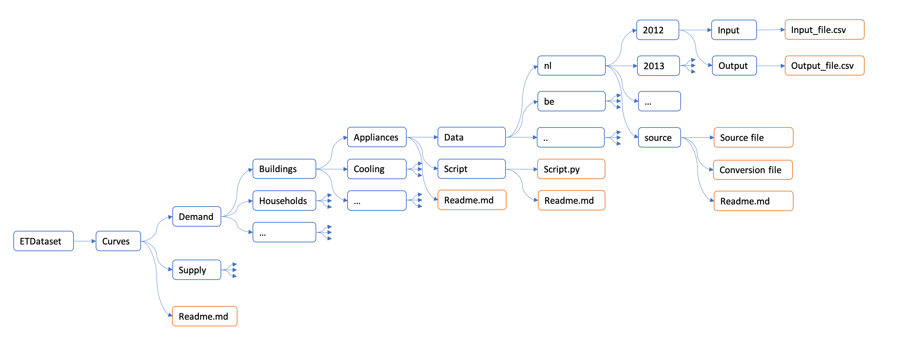

# Curves - ETDataset

This folder contains all sources, data processing files and final files for demand and supply curves used in the ETM.

Our [documentation](https://github.com/quintel/documentation/blob/master/general/curves.md) contains an overview of all used curves and the processing method.

## Discussion
Feedback on the curves we use is very welcome!
If you have a comment or a better source please let us know, you can:

* Open an issue in [ETSource](https://github.com/quintel/etsource/issues/new) and assign a team memeber of Quintel, eg:
	* Chaelkruip 
	* Dorinevandervlies
	* Marliekeverweij
	* Roosdekok
* E-mail us: [info@quintel.com](info@quintel.com)

## Structure of ETDataset - curves

The curves are structured by topic.  
Every topic contains countries which contain years.  
Every your contains input and ouput. 

The "Readme" in the topic folders gives a brief summary of the sources and method used. The other Readme's contain more detailed information about either the sources (and data processing of the sources) or the scripts. 

*Schematic representation of folder structure*

### Source
The source folder contains raw data and links to the data source.  
This folder also converts the raw data to a format which can directly be used by the script.  
The source folder is placed in the folder which leads to all subfolders for which the source file applies.  

### Script
The script folder contains a script which converts to input to ETM format and which applies data processing if necessary. 
The script folder is placed in the folder which leads to all subfolders for which the script file applies. 
The script uses input from the input folder and exports its output to the output folder. 

### Input and output
The input folder contains files that are used directly by the script file. 
The output file is used in the ETM. 

## Exporting ETDataset to ETSource

**To be written.**