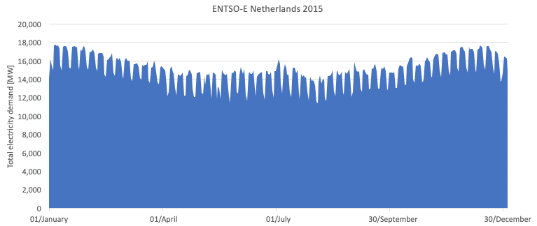
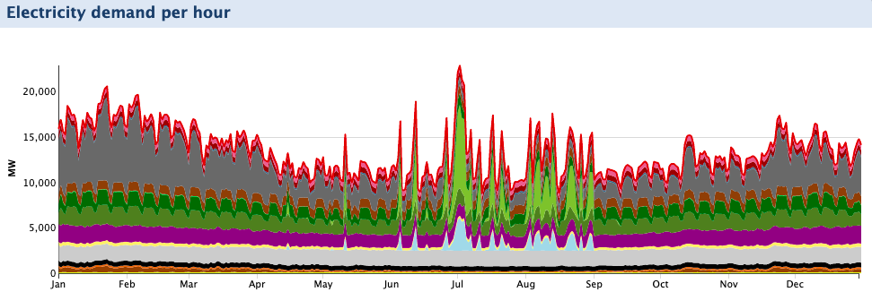
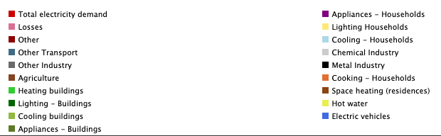
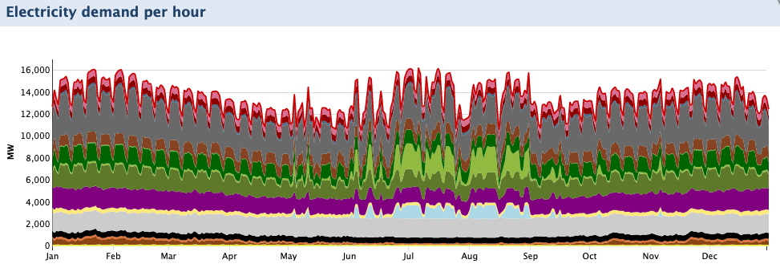
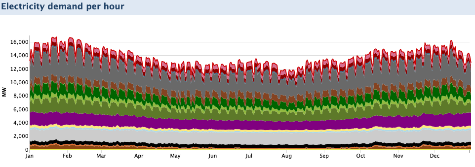

## Households cooling - script

The EDSN curve E1A is used for cooling of households.

Before implementing this method we tested various specific cooling curves. We found that using a specific curve for cooling results in a total electricity demand curve which is very different from the measured total demand curve. 

We are keeping our eyes open for an update of this curve. For example with the (more fundamental) heat loss calculations which TNO is working on.

### Testst with temperature dependent cooling curves

We tested various scripts for cooling curves:

* v1: T dependent, flh 400 h per year
* v2: T dependent and smoothed, flh 1500 h per year (for buildings combined with base load for 50% of the demand)

The scripts and readme's for the scripts can be found [here](https://github.com/quintel/etdataset-public/curves/demand/households/cooling/test scripts). On testing the outcome of these curves we found that the total demand curve is distorted quite dramatically by the temperature dependent cooling curve.

There are some reasons for this:

A reason for this is that the electricity demand for cooling is part of the EDSN E1A and E3A curves which we use for appliances of households and buildings. We could subtract the cooling curve from the EDSN curve (with a dataset dependent factor). However, as there is no measured data available for cooling and the electricity demand of cooling is a pretty rough estimate we fear that this method will only provide false certainty.
 
We therefore choose to use the EDSN E1A curve for cooling of households and E1C curvefor cooling for buildings. 

#### Images 

*For reference, the total electricity demand for Netherlands 2015*

*Total electricity demand per hour with cooling script v1*

*Total electricity demand per hour with cooling script v2*

*Total electricity demand per hour with cooling curve E1A for households and E3A for buildings*
