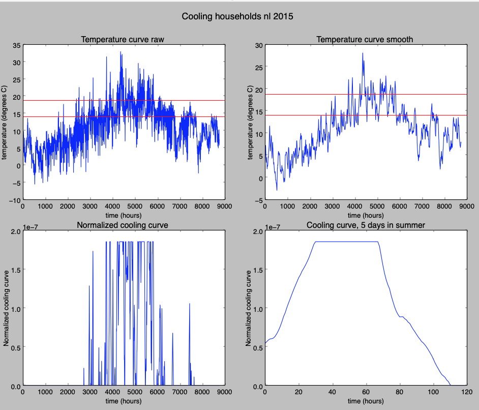

### Households cooling - script

The script `*households_cooling_demand_profile_generator.py` is used to generate a curve for cooling of households. 

The method we use is far from perfect and for a major part based on educated guesses. We plan to update this method with (more fundamental) heat loss calculations which TNO is working on.

### Summary

The cooling curve is directly related to the temperature curve. In short the cooling curve defines the number of degrees that an average household is cooled. 

There are four data-processing steps in the script:

* **Smoothing**   
The temperature curve is smoothed with a running average of 24h. This simulates a lag between temperature differences and effect.
* **Subtracting the lower limit from the temperature**   
The lower limit temperature is subracted from the smoothed curve. Cooling only occurs when the temperature is above the lower limit.
* **Finding the upper limit**  
The maximum cooling is the difference between the upper and lower limit. The upper limit is determined iteratively. The upper limit is increased until the full load hours (flh) of the curve reaches the defined flh. The cooling curve is the smoothed temperature curve between the lower and upper limit
* **Normalizing curve to 1/3600** 
The ETM needs the sum of the curve to be 1/3600

--

### Full load hours

A typical flh for individual cooling technologies in The Netherlands is 400 h. This number is based on various installers/branch organisations:

* [AESystems](http://www.aesystems.nl/en/wist-u-dat-u-bijna-energieneutraal-kunt-worden/): 400 h/year
* [Green Home](https://kennis.greenhome.nl/warmtepomp/koelen-met-warmtepomp/): 400 h/year
* [Warmtepomp-info](https://www.warmtepomp-info.nl/warmtepomp/investeringskeuze/): 400 h/year

If the peak curve / average curve ratio is too high the cooling demand of households results in unrealisticly high peaks in electricity demand for cooling.

In order to ensure the curve represents a realistic demand curve of all cooling technologies together (aggregated) we use 1500 fhl per year.

### Used parameters

* Number of hours for running average: 24 h
* Lower limit: 14 oC
* Full load hours = 1500

For NL 2015 this results in:

* Cooling ends at 18.7 oC
* Peak curve / average = 5.9

and gives this curve:

*Cooling curve for households nl 2015*
