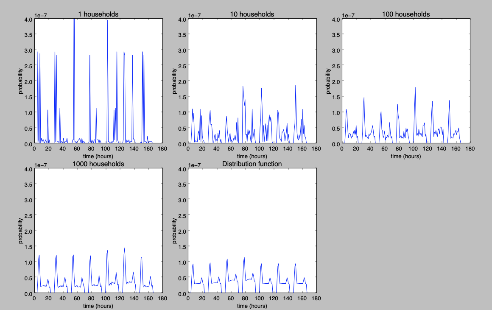

## Households - hot water

The curve for households hot water is based on Domestic Hot-Water Profiles in Different Time Scales, [Jordan (2001)](https://refman.energytransitionmodel.com/publications/2065). We use the distribution curve which gives an aggregated curve.

We experimented with various aggregation levels and generated curves for 1, 10, 100 en 1000 households as well as the distribution function. The curves of sets of households consist of a sum of individual curves. These individual curves are generated for typical Dutch households of 1 to 5 persons. For more information see `households_hot_water_x_households_y_days.py`.

The smallest datasets in the ETM typically consist of 1000 households. As the curve for a combination of 1000 individual households resembles the distribution function pretty well we decided to use the distribution function for all our datasets.

