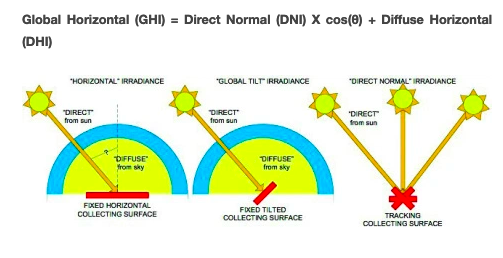

## Solar thermal curves

Script: `solar_thermal_production_curve_generator.py`.

This script converts global horizontal irradiation (GHI), a set Tdiff and panel parameters to a solar thermal production curve and FLH of solar thermal.

Contrary to solar PV for solar thermal there is a delay between solar irradiation and production. The solar thermal panel needs to establish a desired Tdiff before heat can be extracted. We model this in a simplified way with the following steps:

* Set panel specifications and the efficiency curve (based on [Arcon-Sunmark HT-SolarBoost 35/10](https://refman.energytransitionmodel.com/publications/2106))
* As long as Tdiff is smaller than Tdiff_set the heat absorbed by the panel is used to increase Tdiff
* When Tdiff is equal to Tdiff_set all heat absorbed by the panel is used for heat production
* At 00:00h every day Tdiff is set to 0, this is based on the assumption that the panel is cooled to ambient temperature during the night

Tdiff_set was determined iteratively to be 48 degrees C. With this Tdiff full load hours (FLH) for NL2015 = 684 h. This is based on a default FLH of 587 h/y (see [node source analysis](https://github.com/quintel/etdataset/blob/master/nodes_source_analyses/energy/energy_solar_thermal_solar_radiation.central_producer.xlsx)). According to the [KNMI](https://www.knmi.nl/nederland-nu/klimatologie/maand-en-seizoensoverzichten/2015/jaar), 2015 was a very sunny year (1894 sun hours compared to an average of 1639 sun hours), implying that a number of 587 FLH is too low. To determine the FLH for 2015 the reference number of FLH was scaled up based on the number of yearly sun hours, resulting in 1894 / 1639 * 587 = 684 FLH. For other countries and other years the flh follow from the script using the set Tdiff combined with GHI.

#### Converting direct and diffuse irradiation profiles to a global irradiation profile

Script: `direct_and_diffuse_to_global_irradiation.py`.

If global horrizontal irradiation (GHI) cannot be measured directly, it may be calculated from direct normal irradiance (DNI) and diffuse horizontal irradiance (DHI) using the following equation ([source](https://pvpmc.sandia.gov/modeling-steps/1-weather-design-inputs/irradiance-and-insolation-2/global-horizontal-irradiance/)):

<!--GHI = DHI + DNI * cos (&theta;Z)-->

The Python [pvlib](https://pvlib-python.readthedocs.io/en/stable/package_overview.html) library was used to calculate the [hour angle](https://pvlib-python.readthedocs.io/en/stable/generated/pvlib.solarposition.hour_angle.html) in local solar time in degrees (&theta;), which is dependent on the longitude of the country and the [equation of time](https://pvlib-python.readthedocs.io/en/stable/generated/pvlib.solarposition.equation_of_time_pvcdrom.html).

The following longitudes were used:

| Country | Longitude |
| ------- | --------- |
| BE | 4.4699 |
| DE | 10.4515 |
| DK | 9.5018 |
| ES | 3.7492 |
| FR | 2.2137 |
| PL | 19.1451 |
| UK | 3.4360 |

=======
### Solar thermal curves

* Panel specs are based on [Arcon-Sunmark HT-SolarBoost 35/10](https://refman.energytransitionmodel.com/publications/2106)
