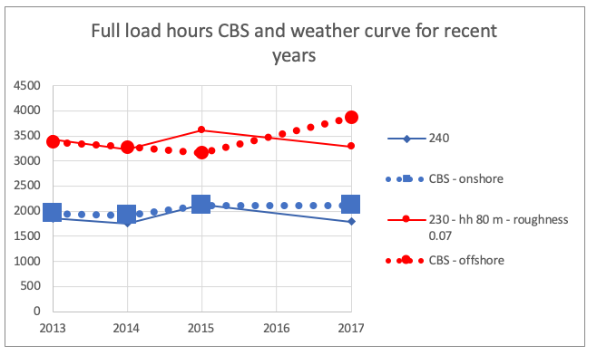
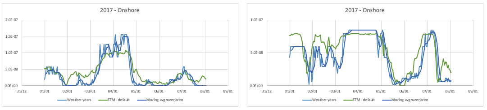
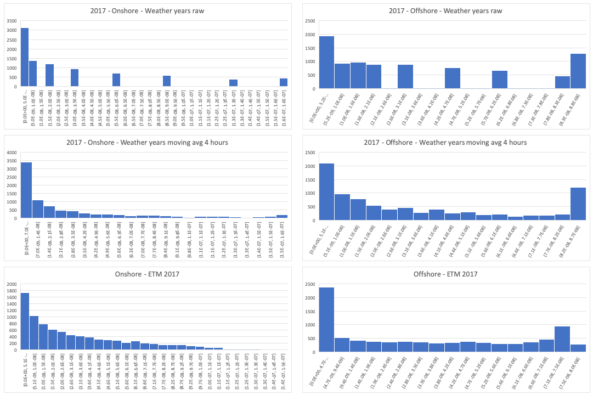

# Generating production curves and full load hours (FLH) values for weather years

The wind load curves which are based on data provided by the [Open Power System Data platform](https://data.open-power-system-data.org) are not available for the weather years (1987, 1997, 2004). That is why we use measured wind data and convert that to production.

### Scripts
The file `generate_wind_curves_weather_years.py` imports input data from `data` and converts this to a normalized wind curve. As with all load profiles, we normalize the load profiles to 1/3600. This results in the following output csv files:

* `wind_coastal_baseline.csv`
* `wind_inland_baseline.csv`
* `wind_offshore_baseline.csv`

**Please note:** 

* For 1987 the file `generate_wind_curves_weather_years_1987.py` should be used. We use a different data source for 1987 and therefor have to use different parameters. For details see section "Parameters".
* For weather years the flh and curves for coastal and inland wind turbines are the same. 

### Sources wind data

**Onshore/coastal data**: The onshore data is downloaded from the [KNMI KNMY database](https://knmy.readthedocs.io/en/latest/) using `process_wind_speed_data.py`.
We use station 240: Schiphol.

**Offshore data**: The offshore data is downloaded from [KNMI - Uurgegevens van Noordzee stations](https://www.knmi.nl/nederland-nu/klimatologie/uurgegevens_Noordzee).
We use Station 320 - Lichteiland Goeree as this station has the best data availability for the weather years.

**Offshore data 1987:** Weatherstation 320 does not have a complete dataset for 1987. Therefor we used data from the [KNMI datacenter](https://data.knmi.nl/datasets/KNW-CSV-TS/1.0?bbox=51.9,3.8,51.8,3.7&dtend=1987-12-31T22:59Z&q=knw&dtstart=1986-12-31T23:00Z).

### Parameters power curve
Conversion from wind to power is done using the method described in section 3.1 of [van der Wiel et al. 2019](https://refman.energytransitionmodel.com/publications/2104). 

In order to better match known data we

* use a hubheight of 80 m instead of 120 m for offshore wind,
* use a roughness factor of 0.07 instead of 0.11 for offshore wind,
* use a moving average of four hours to match better to correct for measuring just at one weather station and for modelling just one turbine type.
* For 1987 wind measurements at 100 m and a hubheight of 150 m is used in combination with simulated wind data from [KNMI datacenter](https://data.knmi.nl/datasets/KNW-CSV-TS/1.0?bbox=51.9,3.8,51.8,3.7&dtend=1987-12-31T22:59Z&q=knw&dtstart=1986-12-31T23:00Z) at measurement heigth 100 m. For 2013 both simulated data from KNMI and measured FLH from CBS are available. For 2013 CBS reports 3381 FLH for offshore wind. The above parameter combination results in 3369 FLH for 2013.

### Selection of weather station
For recent years [CBS](https://opendata.cbs.nl/statline/#/CBS/nl/dataset/70802NED/table?dl=29E3E) provides flh for inland and offshore. With this we can check whether the total annual production as derived with the weather curve method is consistent with published total annual production. 

*FLH as provide by CBS and as constructed with the method used for weather years*

### Comparison measured and constructed curves

For 2017 we have both weather data and measured production curves. So it is possible to check if the method we use to construct wind production curves is consisten with the measured curves. The image below shows both the measured and the constructed curve. ETM-default represents the measured curve. The **moving avg weerjaren curve** shows the curve which was constructed using the weather years method.

*Constructed and measure weather curve onshore (left) and offshore (right). The ETM - default curve represents the measured curve*

*Histogram of wind production onshore (left) and offshore (right). The ETM - default curve represents the measured curve*

