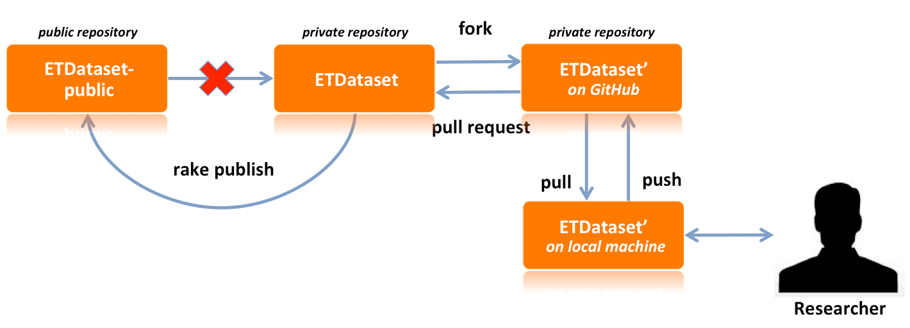

# Generate output files

The documentation on generating output files consist of the following sections:

- [**Introduction**](#introduction)
- [**Before getting started**](#before-getting-started)
- [**A. Invesigate the Input Data generation process**](#a-investigate-the-input-data-generation-process)
- [**B. Manipulate Input Data of an existing dataset**](#b-manipulate-input-data-of-an-existing-dataset)
- [**C. Create Input Data for a new country or year**](#c-create-input-data-for-a-new-country-or-year)

##Introduction

One of the key ingredients in the creation of a dataset is the IEA energy balance. Since these energy balances are proprietary, they cannot be published in a public repository. Therefore, we created two versions of the ETDataset repository:

1. [ETDataset](https://github.com/quintel/etdataset) is a **private** repository that is used by Quintel to generate the Input Data for all countries shown in the ETM.
2. [ETDataset-public](https://github.com/quintel/etdataset-public) is a **public** copy of the [ETDataset](https://github.com/quintel/etdataset) repository, but without the proprietary energy balances.

If you would only like to investigate the dataset generation process, you can use the public [ETDataset-public](https://github.com/quintel/etdataset-public) repository. This repository contains the entire dataset for the dummy country *example* including a fictional energy balance and allows you to play around with the dataset generation process without having to purchase any IEA energy balances.

If your aim is to adapt the dataset for a real country or if you want to add a new dataset for another country or year, you need to get acces to the private [ETDataset](https://github.com/quintel/etdataset) repository. Read below how to do this and contact [Quintel](http://quintel.com/contact) for more information.d

The following image shows a schematic overview of the relation between ETDataset and ETDataset-public.

Like in any other software development project, only the core development team, in this case Quintel, has access to the ETDataset repository. If a researcher wants to make changes to ETDataset, he has to make a fork of ETDataset (depicted as ETDataset' in the image). The only important difference between ETDataset and any other software development project is the fact that both ETDataset and ETDataset' need to be private repositories. Only after signing a Non-Disclosure Agreement with Quintel will a reseacher be allowed to fork ETDataset to ETDataset'. Once the researcher has forked ETDataset, he can start making changes to ETDataset'. If he is satisfied with these changes, he can send a pull request to Quintel, requesting to merge his changes in ETDataset.

Quintel will regularly publish the changes made in the private ETDataset to the public ETDataset-public, without the IEA energy balances. By doing so, we make sure that the ETDataset-public is up to date with ETDataset.

## Before getting started

Before getting started with generating output files you need to:

1. Gain access to the [ETDataset](https://github.com/quintel/etdataset) (only required if you want to make changes to ETDataset, otherwise use [ETDataset-public](https://github.com/quintel/etdataset-public).

2. Get up to speed with using Git on your local computer. Clone [ETDataset](https://github.com/quintel/etdataset) (or [ETDataset-public](https://github.com/quintel/etdataset-public) if you only want to review the data generation process), [ETSource](https://github.com/quintel/etsource) and [Atlas](https://github.com/quintel/atlas) repositories into a common project folder on your computer.

3. Make sure that you have your `.gitconfig` set to always rebase (if someone else pushed their changes before you, this will lead to a merge conflict):

		[branch]
	    	autosetuprebase = always

4. Make sure everything is up do date by running `git up` on all repositories and a `bundle install` on ETDataset, ETSource and Atlas.

5. Microsof Excel is required to open the Analyses Manager and the Research Analysis. You will have to allow VBA scripts (macros) in order to work with these Excel files. The macros are used to read input data and write output data. All our macros are stored in the [Analysis Mananger](../analysis_manager.xlsm). These macros have been tested to work on Mac OS X 10.8 and 10.9 with Excel for Mac 2010, Windows XP with Excel 2007 and Windows 8 with Excel 2013. If you run a different version of Mac OS X, Windows or Excel and you experience any problems, please [contact](http://quintel.com/contact) Quintel. The macros are only for exporting and importing data from and into the analyses and do not harm your computer.

6. Make sure that you computer's regional settings are set such that the decimal separator is `.`. This is necessary for the analyses to export the data in the correct format to ETSource.

## A. Investigate the Input Data generation process

This step-by-step guide can be used for examining the Input Data generation process. Please refer to [B. Manipulate Input Data of an existing dataset](#b-manipulate-input-data-of-an-existing-dataset) if you are aiming to make changes to the dataset.

1. First, make sure your local machine is up to date by running `git up` in the [ETSource](https://github.com/quintel/etsource) and [ETDataset](https://github.com/quintel/etdataset) (or [ETDataset-public](https://github.com/quintel/etdataset-public)) repositories.
* Open the [Analysis Manager](../analysis_manager.xlsm) and enable the macros (a warning appears upon opening the Analysis Manager).
* On the **Dashboard** sheet of the Analysis Manager you can choose a country and year. All analyses will be opened with regard to the country and year you specified in the Analysis Manager. Choosing **example** and **2011** will open our example dataset. (Note: Choosing **nl**, **de** or **eu** requires an original IEA energy balance.)
* Open the analysis of your intereset (e.g. the`1_CHP analysis`) by clicking the associated `open` button.
* Have a look around! You will notice that many checks fail (marked red). This is because the analysis still lacks inputs.
* Hit the `import data` button on the top right of the **Dasbhoard** sheet. In the `1_CHP analysis` this will import the energy balance, the autoproducer table and previous dashboard values. Furthermore, the technical specifications are loaded from [ETSource](https://github.com/quintel/etsource). (Note: The `import` button performs different actions in different analyses.)
* Since you have loaded an existing country and year, most checks on the dashboard are probably green now. You can look around and make changes to the inputs on the Dashboard sheet.
* When you are done, you can choose between the following options:
  - **Save your work**: Hit the `export data` button on the **Dashboard** sheet. All relevant data will be written to CSV files in the respective output folder. Your Dashboard inputs will also be saved (input cells only). Existing files are overwritten. After the export is complete, the analysis will close automatically.
  - **Discard your work**: You may decide to close the analysis without hitting the `export data` button. Simply close the analysis, but **DO NOT SAVE IT**. You must never save data (dashboard inputs, energy balance etc.) in the analysis itself.

## B. Manipulate Input Data of an existing dataset

1. First, make sure your local machine is up to date by running `git up` in the [ETSource](https://github.com/quintel/etsource) and [ETDataset](https://github.com/quintel/etdataset) repositories.
* Next, make sure to [create a new branch](working_with_git.md#1-create-a-new-branch-in-your-local-repository-and-make-sure-you-are-on-that-branch) in the ETDataset repository so you can easily discard results that are not to your liking.
* Open the [Analysis Manager](../analysis_manager.xlsm) and enable the macros (a warning appears upon opening the Analysis Manager).
* On the **Dashboard** sheet of the Analysis Manager you can choose a country and year. All analyses will be opened with regard to the country and year you specified in the analysis manager. Choosing **example** and **2011** will open our example dataset. (Note: Choosing **nl**, **de** or **eu** requires an original IEA energy balance.)
* Open the `1_CHP analysis` by clicking the associated `open` button.
* Have a look around! You will notice that many checks fail (marked red). This is because the analysis still lacks inputs.
* Go back to the finder or explorer and go to the directory `~/etdataset-public/data/example/2011/1_chp/input`. It contains the a dummy IEA energy balance, a dummy IEA autoproducer table and a file containing dashboard values for the example country. You will notice that next to the input folder, there is also an output folder. Here, all outputs of the CHP analysis will be written.
* Go back to the CHP analysis in Excel and hit the `import data` button on the top right of the **Dasbhoard** sheet. This will import the energy balance, the autoproducer table and previous dashboard values from the input folder. Furthermore, the technical specifications are loaded from [ETSource](https://github.com/quintel/etsource). (Note, that the `import` buttons perform different actions in different analyses.)
* Since you have loaded an existing country and year, most checks on the dashboard are probably green now. You can look around and make changes to the inputs on the Dashboard sheet.
* When you are done, you can choose between the following two options:
  - **Save your work**: Hit the `export data` button on the **Dashboard** sheet. All relevant data will be written to CSV files in the respective output folder. Your Dashboard inputs will also be saved (input cells only). Existing files are overwritten. After the export is complete, the analysis will close automatically.
  - **Discard your work**: You may decide to close the analysis without hitting the `export data` button. Simply close the analysis, but **DO NOT SAVE IT**. You must never save data (dashboard inputs, energy balance etc.) in the analysis itself.

Now, you have gone through one cycle of opening an analysis for a certain country and year, importing and manipulating country specific information and exporting CSV files. If you made changes in the Dashboard of the CHP analysis and exported new CSV files, you might like to investigate the effect of these changes in the ETM and share your work with other. Please continue with [Testing the dataset](../README.md#2-testing-the-dataset) in the general README.

## C. Create Input Data for a new country or year

Note: The filepaths in the following items assume that you are adding a new country or year in ETDataset. If you are working on ETDataset-public, your files will be in `~/etdataset-public` instead of `~/etdataset`.

1. First, make sure your local machine is up to date by running `git up` in the [ETSource](https://github.com/quintel/etsource) and [ETDataset](https://github.com/quintel/etdataset) repositories.
* Next, make sure to [create a new branch](working_with_git.md#1-create-a-new-branch-in-your-local-repository-and-make-sure-you-are-on-that-branch) so you can easily discard results that are not to your liking.
* Open the [Analysis Manager](../analysis_manager.xlsm) and enable the macros (a warning appears upon opening the Analysis Manager).
* In the **Dashboard** of the Analysis Manager fill in a new country and year.
* Open the `1_CHP analysis` by clicking the associated `open` button
* Since the analysis for that specific country and year has not been performed yet, the Analysis Manager will raise a warning if you really want to create that country or year. If you hit `yes`, the Analysis Manager will create a new folder in `~/etdataset/data/(country)/(year)/1_chp/input/`
* You need to obtain the IEA energy balance and IEA autoproducer table for your country and year in a very specific format (see [here](IEA_data_format.md) for details). This data can be bought on http://data.iea.org/ieastore/default.asp. You will need to purchase an **'Extended energy balance'** and a **'Net electricity and heat production by autoprocuder'** table. Make sure you download an EXCEL file from the IEA website, it turns out that the CSV file reports fewer significant digits! After downloading these files, you need to save them as CSV files, in a *very specific format*. Look at the example data as a role model. Both data tables need to have the exact same headers in the exact same position. If you align cells differently, your data will be pasted into a wrong position, which the Excel analyses cannot deal with. Make sure that your data tables do not contain more/less headers than our those for our example country ([Energy balance](../data/example/2011/1_chp/input/iea_energy_balance.csv), [Autoproducer table](../data/example/2011/1_chp/input/iea_autoproducer_table.csv)). Pay special attention to the number of columns as the Energy Balance does not contain the same number of columns every reporting year (see e.g. [the documentation](../source_analyses/nl/2012/0_preparation/0_data_preparation_source_analysis.md) on how the NL 2012 Energy Balance was prepared for use in the dataset generation process. Copy the CSV files into the `~/etdataset/data/(country)/(year)/1_chp/input/` folder, use default file names (see [*example* data folder](../data/example/2011/1_chp/input)). Furthermore, you should be aware of the fact that IEA tables may contain confidential cells. Non-numerical cells in unexpected locations may cause problems in the Excel calculations.
* Upon clicking the 'import data' button in the CHP analysis, you will notice that some of the imports failed.
  - The import of the IEA energy balance and autoproducer table may fail. Make sure you created those CSV files with the correct file name, in the right location.
  - The import of 'dashboard values' will fail, because there is no dashboard.csv file in the `~/etdataset/data/(country)/(year)/(analysis)/input` folder yet. You can import dashboard settings from a different analysis by clicking on `Load different Dashboard values` or simply fill the Dashboard manually.
* Now, adjust your inputs to the Dashboard until all critical checks pass. If you want to create high quality Input Data, you will need to create a [**Source Analysis**](../source_analyses) that justifies you inputs. You may want to ask yourself questions like: How much conventional capacity is installed? How many full load hours are realistic? Filling in the CHP analysis tends to be a bit like solving a puzzle, so do not expect a perfect result.
* If you want to save your work, you need to hit the `export` button. **DO NOT SAVE your work in the Excel workbook**. You can open the analysis again later, and load the settings you exported.
* Once you are done with the CHP analysis, you can move on to the Power and Heat plant analysis and so forth...

Now, you have gone through one cycle of creating a dataset for a certain country and year. You now might like to test your dataset in the ETM and share your work with other. Please continue with [Testing the dataset](../README.md#2-testing-the-dataset) in the general README.

