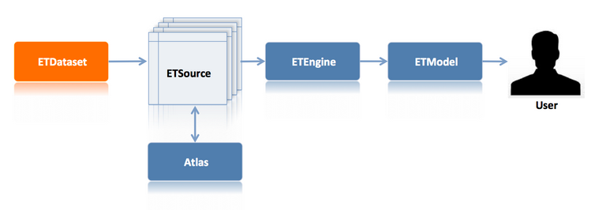
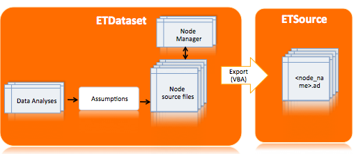

# ETDataset – nodes source analyses

The [ETDataset](https://github.com/quintel/etdataset-public) is a repository that includes all the input data of the [ETModel](https://github.com/quintel/etmodel). Once the [ETDataset](https://github.com/quintel/etdataset-public) is completed, it needs to be exported to [ETSource](https://github.com/quintel/etsource)  from where the **Input Data** will be used in calculations by [ETEngine](https://github.com/quintel/etengine). The user can interact with the model through the front-end of the [ETM](http://www.et-model.com) that is maintained in the [ETModel](https://github.com/quintel/etmodel) repository.

A **nodes_source_analyses** repository is created and stored in the [ETDataset](https://github.com/quintel/etdataset-public) repository. The nodes_source_analyses repo includes Excel files of all the nodes that are used in the [ETModel](https://github.com/quintel/etmodel). The nodes_source_analyses is dedicated to the analyses of the technical and costs parameters of the nodes. Once a nodes_source_analysis is completed, it needs to be exported to [ETDataset](https://github.com/quintel/etdataset-public), from where will be exported to [ETSource](https://github.com/quintel/etsource) using a VBA functionallity. The following image  describes the dataflow used to transfer the data from the nodes_source_analysis to [ETDataset](https://github.com/quintel/etdataset-public) and then to [ETSource](https://github.com/quintel/etsource).

The main reasons for creating the nodes_source_analyses are:

- 	Update the technical and cost parameters of nodes that are used in the [ETModel](https://github.com/quintel/etmodel).
- Document the technical and cost parameters of nodes and make them transparent to the public. 
- Document the technical and cost parameters of nodes in a more comprehensive way for the public.
- Document the technical and cost parameters of nodes in a simple way, that easily can be updated in the future.
- Document the analyses of the technical and cost parameters of nodes and present the sources that are used for the calculations. 

The analyses of the technical and cost parameters are based on data from various institutions’ reports.

##Content

The nodes_source_analyses repository contains folders of all sectors:

- Households
- Buildings
- Energy
- Transport
- Industry
- Agriculture.

Each folder includes Excel files of the relevant nodes. The Excel files contains the following sheets:

- The **Cover Sheet**, which introduces to the reader the analysed node and explains the following sheets.
- The **Dashboard**, this sheet includes all the attributes of the analyzed node. The columns of this sheet refer to:
  - Name of the node attribute
  - Unit of the node attribute
  - Value of the node attribute
  - Definition of the node attribute
  - Sources of the node attribute

- The **Research data**, this sheet includes the calculations and sources used for the technical and costs parameters. The columns include:
  - Name of the parameter
  - Unit of the parameter
  - Value of the parameter
  - Sources used for the calculation of the parameter
  - Comments
- The **Sources**, this sheet summarizes all the sources used for the analysis. The columns include:
   -   Name of the source
   -   Date published/ retrieved
   -   Subject year
   -   ETM Library URL, all the documents used are stored to the [ETM Library](http://refman.et-model.com/)
   -   Link of the source
- The **Notes**, it includes notes and screenshots of the sources used for the calculation. 

# Generate node source analyses
The main purpose of this repository is to document the nodes used in the  [ETModel](https://github.com/quintel/etmodel), putting focus on the analyses of the **technical and cost parameters**. This section outlines the process and methods used for the documentation of the nodes.

Excel files are used for the documentation of the nodes, in order to keep the node_source_analyses as simple as possible for the public, The following steps and methods were used in order to create an Excel file of each node.
1.  Copied all attributes of the node from [ETSource](https://github.com/quintel/etsource) to the **Dashboard** sheet.
2.	Researched for new sources in order to update the values of the technical and cost parameters of the node. For the calculation of the new values the following methods were used:
     - The latest and most reliable sources were used and an average value of the sources was taken.
    - The value of each parameter is dynamic, so in case of any change it automatically changes to the **Dashboard** sheet.
    - Sreenshots and notes  of the sources used were taken, in order to make it easier for the reader to verify the data from the relevant source.
    - The values are linked in all sheets (**Dashboard** , **Research data** and **Notes**  ).
3.  All the documents used for the analyses are stored in the [ETM Library](http://refman.et-model.com/). 
4. The name of the Excel file is the same with the equivelant node (i.e. <node_name>.xlsx).

## Export data to ETDataset
Once the Excel file is completed, it need to be exported to [ETDataset](https://github.com/quintel/etdataset-public). The data of the [ETDataset](https://github.com/quintel/etdataset-public) is available in the GitHub repository, you can read more about GitHub  [here](https://guides.github.com/introduction/getting-your-project-on-github/index.html). 

Exporting data to  [ETDataset](https://github.com/quintel/etdataset-public) includes the following steps:

 - Create a new branch
 - Commit your changes
 - Push commits to remote repository
 - Create a pull request

 More details can be found [here](https://github.com/quintel/etdataset-public/blob/master/README.md).

 
## Export data to ETSource
Once the data from the node_source_analyses is exported to [ETDataset](https://github.com/quintel/etdataset-public) and merged, then needs to be exported to [ETSource](https://github.com/quintel/etsource). This can be done with the VBA functionality, which is stored to the **node_manager**. The node_manager was cteared for exporting the data form [ETDataset](https://github.com/quintel/etdataset-public) to [ETSource](https://github.com/quintel/etsource). It is a .xlsm file and is also stored to [ETDataset](https://github.com/quintel/etdataset-public). The node_manager:

 -  Contains all the VBA functionality
 
 -  Contains general remarks on source documentation of node attributes
 -  Allows easy opening of source documents through browse menu.
 
Exporting data to  [ETSource](https://github.com/quintel/etsource) includes the following steps:

 - Create a new branch
 - Open the Excel file through the node_manager
 - Commit your changes
 - Push commits to remote repository
 - Create a pull request
 
 
## Document a new node

It is simple to create a new documentation for a node. The following steps need to be made for the new Excel file:

 -  Name the Excel file with the same name of the node and save it to the right folder
 -  Copy all the node attributes from [ETSource](https://github.com/quintel/etsource) to **Dashboard** sheet
 -  Research for new sources and document them in the **Research data** sheet
 -  Keep screenshots and notes of the sources used in the **Notes** sheet
 -  Use the [ETM Library](http://refman.et-model.com/) to store all the new sources
 -  Make the values linked in all sheets (**Dashboard** , **Research data** and **Notes** )
 -  Export the new data to [ETDataset](https://github.com/quintel/etdataset-public) and create a pull request
 -  Once the pull request is merged, export data to [ETSource](https://github.com/quintel/etsource). 
 
 

