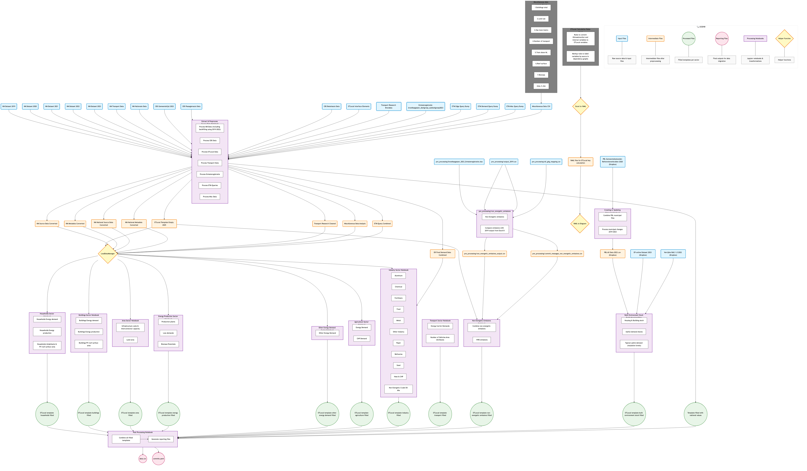

# ETLocal Municipal Dataset Pipeline

## 📋 Table of Contents
- [Overview](#overview)
- [Architecture](#architecture)
- [Quick Start](#quick-start)
- [Prerequisites](#prerequisites)
- [Execution Flow](#execution-flow)
- [Directory Structure](#directory-structure)
- [Data Sources](#data-sources)
- [Validation & Quality Checks](#validation--quality-checks)
- [Troubleshooting](#troubleshooting)
- [Future Improvements](#future-improvements)
- [Support](#support)

## Overview

This pipeline updates municipal datasets for ETLocal, the dataset manager of the ETM. Currently, it is only possible to update _all_ municipal datasets at once (no single-municipality option).

**Purpose**: Enable periodic updates of municipal datasets and allow retrieval of all data processing steps to trace back where data came from.

**Output**: 
- `data.csv`: Numerical data for all ETLocal keys for all Dutch municipalities
- `commits.yaml`: Documentation outlining how each datapoint was calculated and which source data was used

**Target Users**: Internal team members who need to understand the origin of municipal data, execute dataset updates, or improve the pipeline.

## Architecture



The pipeline follows a sequential processing model:
1. **Extract & Preprocess**: Creates ETLocal template, cleans all source data and prefills the template with data from the national dataset
2. **Sector Processing**: 9 parallel notebooks process sector-specific data
3. **Post-processing**: Combines all sector outputs into a data.csv and commits.yaml file for ETLocal data migration

## Quick Start

1. **Install dependencies**:
  Run `pipenv shell` in the `pipelines` folder in your terminal. It activates the python version required for this pipeline including all relevant libraries.
  If you get a message saying `module XXX not available`, run `pipenv install` to locally install all missing library. You should only have to do this once.

2. **Setup data access**:
   You'll need access to the Dropbox folder: `756 Gemeentelijke datasets 2023/Grote databestanden` for some large data files. These cannot be stored on github because of their size.
   
   If you need to import data for a specific notebook, the notebook tells you 

3. **Execute pipeline**:
   ```
   # Step 1: Run the Extract and preprocess Notebook (if applicable)
   Only take this step if you want to include new data from any of the sources (e.g. Klimaatmonitor, Emissieregistratie, CBS, miscellaneous analysis, ...).
   Open the notebook and 'Run all cells' / run relevant sections. This results in an updated version of csv files in the `/data/intermediate` folder.
   
   # Step 2: Run sector notebooks (can run in parallel)
   Open the notebook and press 'Run all cells' to update all data.
   
   # Step 3: Generate final output
   Open the notebook `Post processing` and run all cells.
   ```

4. **Validate output**:
   - Check `data/reporting/data.csv` for empty cells (meaning e.g. new ETLocal keys that have not yet been included in the pipeline)
   - Verify `data/reporting/commits.yaml` for any missing or nonsensical commit messages

## Prerequisites

**System Requirements and data access**:
The pipeline should work with any Quintel system setup. Make sure you have access to the folder `756 Gemeentelijke datasets 2023/Grote databestanden` to retrieve any data files that are too large for Github.

**Estimated Runtime**: Running all notebooks should take you ~30 mins or so. Reserve about 4 hours if you include the data migrations on ETLocal and ETSource and subsequent PRs.

## Execution Order

### 1. Required First Step
- `Extract and preprocess source data.ipynb`
  - Processes all raw data sources
  - Creates an ETLocal template that each of the sector notebooks fill
  - Creates intermediate data for sector notebooks
  - Creates an ETLocal template filled with data taken from the national nl2023 dataset
  - **Run this notebook first if any of the source data is updated**

**Note**: the output file `data/intermediate/km_meta_data_converted.csv` contains a match between the internal variable name and the Klimaatmonitor variable name.

### 2. Sector Processing (Independent)
These can run in any order after step 1:
- `Agriculture - municipal dataset update.ipynb`
- `Area - municipal dataset update.ipynb` 
- `Buildings - municipal dataset update.ipynb`
- `Energy Production - municipal dataset update.ipynb`
- `Households - municipal dataset update.ipynb`
- `Industry - municipal dataset update.ipynb`
- `Non Energetic Emissions - municipal dataset update.ipynb`
- `Other Energy Demand - municipal dataset update.ipynb`
- `Transport - municipal dataset update.ipynb`

**NOTE**: the only interdependency here is that the Buildings notebook depends on the Transport notebook. The Transport notebook calculates a distribution key for electric vehicle demand that the Buildings notebook requires.

### 3. Special Processing
- `Built Environment Stock Dutch Municipalities.ipynb`
  - Uses separate data (not processed in step 1)
    - PBL Referentieverbruiken municipal datasets, retrieved from the Excel files on the [VIVET webpage](https://dataportaal.pbl.nl/VIVET/Referentieverbruik_warmte/Gemeentebestanden_XLS)
  - Creates the csv file `pbl_referentieverbruiken_all_data_from_vivet.csv`, which it then subsequently processes
  - Also applies the municipal mergers between 2019-2023 to the PBL Referentieverbruiken municipal csv files
  - **Output**: `data/processed/etlocal_template_built_environment_stock_filled.csv`, to be used in the `Post processing` notebook.
  Can run independently of other notebooks

#### 4. Final Processing
- `Post Processing.ipynb`
  - Combines all sector outputs from `data/processed/`
  - Generates final `data.csv` and `commits.yaml`

### Incremental Updates
**Sector Update**: If you modify one sector notebook:
1. Run the updated sector notebook
2. Run post processing notebook (will include all existing + updated sector data)

**Preprocessing Update**: If source data changes:
1. Re-run extract & preprocess
2. Re-run affected sector notebooks (in case of Klimaatmonitor or nl2023 updates: probably best to rerun all notebooks)
3. Run post processing

## Directory Structure

```
├── README.md
├── Pipfile                          # Python dependencies
├── Extract_and_Preprocess_Source_Data.ipynb
├── [Sector] - municipal dataset update*.ipynb            # Sector processing notebooks
├── Post_Processing.ipynb
├── Built Environment stock Dutch municipalities.ipynb
│
├── config/                         # Configuration & calculation rules
│   ├── etlocal_interface_elements/ # ETLocal template base
│   ├── etlocal_calculation_rules.xlsx # Key calculation definitions
│   ├── yaml_files/                # ETLocal key calculation rules
│   └── mermaid_flow_diagrams/     # Visual pipeline documentation
│
├── source/                        # Reusable scripts and functions
│   ├── load_data_manager.py      # Central data loading utility
│   ├── excel_to_yaml.py          # Convert calculation rules
│   └── yaml_to_diagram.py        # Generate visual documentation
│
└── data/
    ├── raw/                      # Source datasets
    ├── intermediate/             # Preprocessed data for sectors
    ├── processed/                # Filled ETLocal templates per sector
    ├── post_processed/           # Combined intermediate results
    ├── reporting/                # Final outputs (data.csv, commits.yaml)
    ├── pre_processing/           # Non-energetic emissions preprocessing
    │   └── non_energetic_emissions.ipynb
    └── specific_2023_dataset_update/ # 2023-specific auxiliary files
```

## Data Sources

### Primary Sources
- **Klimaatmonitor (KM)**: 2019-2023 municipal energy data
- **CBS**: Municipal lists, vehicle data
- **Transport Research**: outdated, no longer used in the 2023 dataset update. It contains bottom-up figures on energy consumption of e.g. vans and cars to calculate the road electricity demand and corresponding tech split, for example. Can also be accessed via `Quintel/Projects/Other - active/ETLocal/Datasets/2019_update/202110_D_ETLocal_default_datasets_2019_step1.xlsx`
- **Emissieregistratie**: Greenhouse gas emissions on municipal level
- **ETM Queries**: National model outputs
- **ETLocal Interface**: ETLocal keys, to be used to generate the empty ETLocal template.

### External Dependencies
- **PBL Referentieverbruiken** (Dropbox): Municipal csv files for the 2023 PBL Referentieverbruiken study. **Note**: this data is expected to be updated in September 2025. 
- **EP-online Dataset** (Dropbox): 2023 energy performance data, `v20231201_v2_csv.csv`. No longer used in the 2023 update; see `pipelines/Archive (pre-2023 dataset update)/Built environment stock Dutch municipalities - pre-2023 dataset update version.ipynb` to see how it was previously used.
- **TNO Verrijkte BAG** (Dropbox): Energy demand info on non-residential buildings. **Note**: there is a new version of this dataset available on [Energy.nl](https://energy.nl/publications/verrijkte-bag-2-0/), which we haven't used yet.

### Update Frequency
- **Klimaatmonitor**: Continuously updated, stable ~1.5-2 years after data year. However, sometimes data is updated in retrospect, which makes it difficult to retrieve mismatches between the ETM and Klimaatmonitor.
- **Other sources**: Varies by provider

## Validation & Quality Checks

### Built-in Validation
- **Data lineage**: The YAML files (`config/yaml_files_for_etlocal_key_calculation`) and corresponding flow diagram visualization in the sector notebooks show how the internal variables are converted into the ETLocal key. To match the internal variable name with the original source data on e.g. Klimaatmonitor, please consult the `data/intermediate/km_meta_data_converted.csv` and `data/intermediate/km_national_meta_data_converted.csv` files.
- **Filling with older data or zeroes**: The `Extract and preprocess source data/Klimaatmonitor (municiple data)/Extract/Energy data` section uses the `src/helper.fill_missing_KM_data` method to prefill the KM data with data from earlier years or with zeroes in case of missing values.
- **Completeness checks**: Automated validation of required fields. Upon calculating an ETLocal key a dataframe is printed that shows which data point is missing in case the calculation can't be completed.
- **Historical comparison**: The `src/helper.validate_template_data` method contains a comparison of the ETLocal key with the 2019 data

### Manual Validation Steps
1. **Visual inspection**: 
   - Check `data/reporting/data.csv` for empty cells (meaning e.g. new ETLocal keys that have not yet been included in the pipeline)
   - Verify `data/reporting/commits.yaml` for any missing or nonsensical commit messages

2. **ETLocal integration**:
   - Create dataset migration in ETLocal
   - Export to ITSource (final validation occurs here)
   - Failed migration indicates data issues

### Known Limitations
- Pipeline processes all Dutch municipalities (no single-municipality option)
- Historical validation currently uses 2019 baseline (needs updating for future datasets)

## Troubleshooting

### Common Issues

**Memory Overload**:
- IDE might slow down because of large datasets in cache and inefficient pandas syntax
- Applies in particular to Built Environment Stock, Extract & Preprocess, or Industry notebooks
- Solution: restart kernel or drop large datasets from memory

**Missing Dropbox Data**:
- Error: FileNotFoundError for large datasets
- Solution: check that the required data files are present in their respective folders. Check the syntax to check which folders these are.

**Incomplete Output**:
- Symptom: Empty cells in data.csv or missing commits in commits.yaml
- Cause: ETLocal key is included in the template but not in one of the sector notebooks. Or a sector notebook might contain an error so that the ETLocal key isn't calculated.
- Solution: Check individual notebook execution logs

## Future Improvements

**Planned Enhancements**:
- **Modular execution**: Hash-based change detection to run only updated components using e.g. SnakeMake.
- **Single-municipality processing**: Enable targeted municipality updates
- **Tailored municipal updates**: develop a structure to fit in tailored updates for specific municipalities based on specifically supplied data sources
- **Automated validation**: Replace manual validation with automated tests
- **Dynamic baseline**: Update validation baseline from 2019 to previous dataset
- **Source data lookup**: Enable a lookup for e.g. a Klimaatmonitor variable name to see in which ETLocal keys it is used. The yaml files contain this information but currently only show the opposite: which internal variables are used for a single ETLocal key.

**Technical Debt**:
- Apply uniform sector notebook format across all sector notebooks. Notably the Transport notebook still uses a manual compilation of the source data that should be replaced with the approach of e.g. the Households notebook
- Clean up the non-energetic emissions notebooks. It is confusing that there are two notebooks for this: one in `data/pre_processing` that manipulates the Emissieregistratie data, and the `Non energetic emissions` notebook that ultimately fills the ETLocal template

A more extensive description of debts and potential improvements can be found in `Debts and potential improvements municipal datasets.xlsx`.

## Support

**For pipeline issues or improvements**:
- Koen van Bemmelen
- Kas Kranenburg
- Charlotte von Meijenfeldt
- Claudia Valkenier

**Documentation**:
- Pipeline flow diagrams: `config/mermaid_flow_diagrams/`
- Calculation rules: `config/etlocal_calculation_rules.xlsx`
- ETLocal key definitions: `config/yaml_files/`